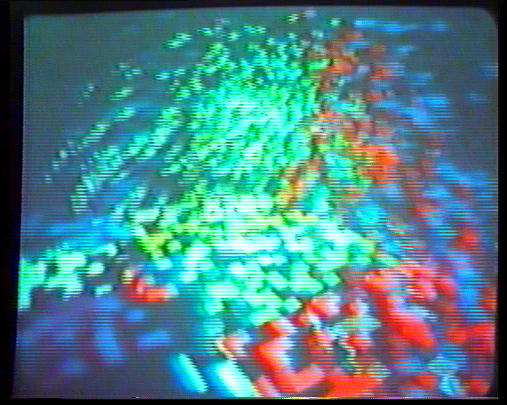
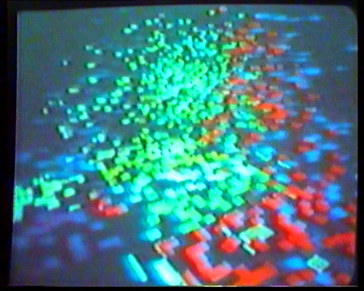
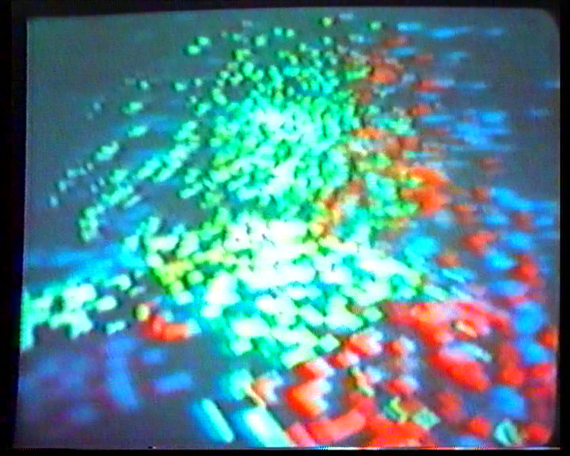

## Deinterlacing with ffmpeg - some notes

**ffmpeg includes several deinterlacers**:
* [`bwdif`](https://ffmpeg.org/ffmpeg-filters.html#bwdif): ‘Bob Weaver Deinterlacing Filter’
* [`kerndeint`](https://ffmpeg.org/ffmpeg-filters.html#kerndeint): adaptive kernel deinterlacing
* [`nnedi`](https://ffmpeg.org/ffmpeg-filters.html#nnedi): uses neural network edge directed interpolation
* [`w3fdif`](https://ffmpeg.org/ffmpeg-filters.html#w3fdif): ‘Weston 3 Field Deinterlacing Filter’
* [`yadif`](https://ffmpeg.org/ffmpeg-filters.html#yadif-1): ‘yet another deinterlacing filter’

As a preliminary exercise I transcoded an interlaced original to H.264/MP4 using each deinterlacer (default settings) in turn:  
`ffmpeg -i sample_video.mov -c:v libx264 -vf "<DEINTERLACER>,format=yuv420p" -preset veryslow -crf 18 -an sample_video_<DEINTERLACER>.mp4`

_Note_: `nnedi` requires a binary file filter as a mandatory input. Therefore the filtergraph for that command was `-vf "nnedi=weights='./nnedi3_weights.bin',format=yuv420p"`.

Visual checks from watching the videos. Example screenshots (`ffmpeg -i input.mp4 -ss 00:00:02 -vframes 1 output.png`):

Original video:  

Deinterlaced with `kerndeint`:  

Deinterlaced with `nnedi`:  

Deinterlaced with `yadif`:  

`w3fdif` didn't work properly, the motion was 'jagged' - looks like an issue with the field order. There are no filter options that would address that, though. This artefact doesn't show up in the still:    

`w3fdif=deint=interlaced` eradicated the movement artefact, but didn't actually deinterlace.

**Comparison** (v. subjective):
* Best: `nnedi` and `yadif`. (_Note_: `nnedi` slower than the rest)
* `kerndeint` less good: had little interlacey patches whereas the latter two didn't.
